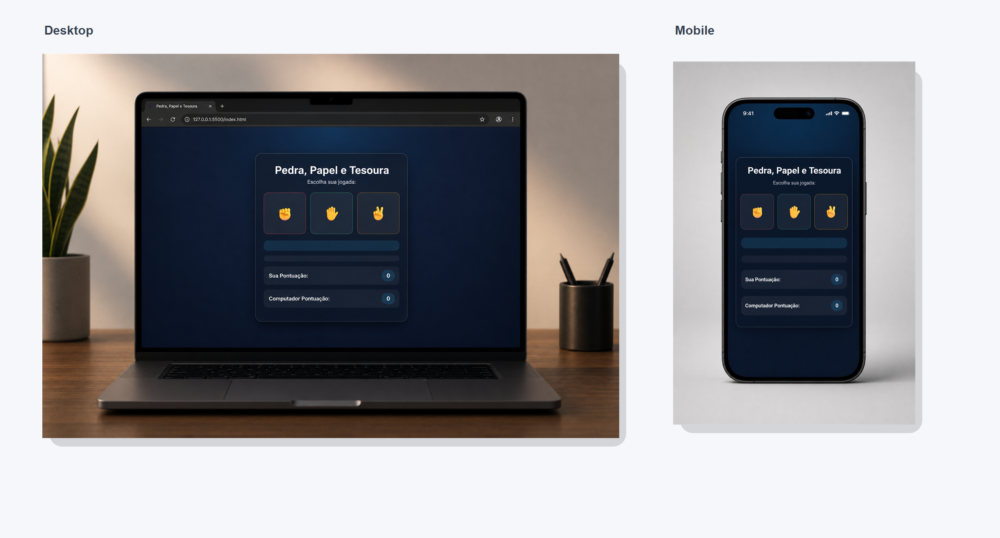

# Pedra, Papel e Tesoura

Jogo clássico contra o computador, feito com HTML, CSS e JavaScript puro.

## Preview

## Acesse o projeto

[🔗 Clique aqui para visualizar](https://christianpinho.github.io/Projeto-Pedra-Papel-Tesoura/)

## Funcionalidades

- Escolha entre pedra, papel ou tesoura
- O computador faz uma escolha aleatória
- Placar separado para jogador e computador
- Mensagem de resultado na tela
- Destaque visual para vitória, derrota e empate
- Layout responsivo para desktop e celular

## Tecnologias

- HTML
- CSS
- JavaScript

## O que foi praticado

- Funções
- Condicionais
- Arrays
- `Math.random()`
- `querySelector`
- `textContent`
- `classList.add()` e `classList.remove()`
- Responsividade
